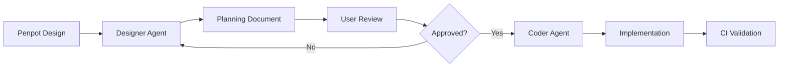

# AGENTS.md - FulgensUI Developer Guide

This file provides guidelines and commands for AI agents working in this repository.

## Project Overview

FulgensUI is a modern UI component library built with React 19, Vite, and PandaCSS. It's a monorepo managed with Turborepo using Bun as the package manager.

## Directory Structure

```text
FulgensUI/
├── packages/
│   ├── core/          # Main UI component library
│   │   ├── src/
│   │   │   ├── components/ui/{component-name}/  # Component files
│   │   │   ├── config/           # PandaCSS tokens, recipes, semantic tokens
│   │   │   └── styled-system/    # Generated PandaCSS output
│   │   └── .storybook/            # Storybook configuration
│   └── docsite/       # Docusaurus documentation site
├── turbo.json         # Turborepo configuration
└── package.json       # Root workspace config
```

## Commands

### Root Level (from project root)

```bash
# Install dependencies
bun install

# Run all packages in dev mode
bun run dev

# Build all packages
bun run build

# Lint all packages
bun run lint

# Test all packages
bun run test

# Clean all packages
bun run clean
```

### Core Package (packages/core)

```bash
cd packages/core

# Run Vite dev server
bun run dev

# Run Storybook (port 6006)
bun run storybook

# Build for production
bun run build

# Lint with ESLint
bun run lint

# Type check with TypeScript
bun run type-check

# Run a single test file
bunx vitest run path/to/testfile.test.ts

# Run tests in watch mode
bunx vitest

# Run tests with coverage
bunx vitest run --coverage
```

## Component Structure

New components should follow this structure:

```text
src/components/ui/{component-name}/
├── index.ts           # Barrel export
├── {component}.tsx    # Main component
├── config/
│   ├── {component}-recipe.ts        # PandaCSS recipe
│   └── {component}-semantic-tokens.ts # Semantic tokens (if needed)
└── storybook/
    ├── {component}.stories.tsx      # Storybook stories
    └── {component}.mdx              # Documentation
```

### Component File Pattern

```typescript
// packages/core/src/components/ui/button/button.tsx
import { ComponentProps } from "react";
import { button } from "@styled-system/recipes";
import type { ButtonVariantProps } from "@styled-system/recipes";

export type { ButtonVariantProps } from "@styled-system/recipes";

export type ButtonProps = ComponentProps<"button"> & ButtonVariantProps;

export function Button(props: ButtonProps) {
  return <button className={button({ ...props })} {...props}></button>;
}
```

### Index File Pattern

```typescript
// packages/core/src/components/ui/button/index.ts
export * from "./button";
```

## Code Style Guidelines

### TypeScript

- **Strict mode enabled** - No implicit any, strict null checks
- Use explicit types for function parameters and return values when not obvious
- Use `interface` for public APIs, `type` for unions/intersections
- Avoid `any` - use `unknown` when type is truly unknown

### Naming Conventions

- **Components**: PascalCase (e.g., `Button`, `Modal`)
- **Files**: kebab-case (e.g., `button.tsx`, `my-component.ts`)
- **Directories**: kebab-case (e.g., `ui/button/`)
- **Variables/functions**: camelCase
- **Constants**: UPPER_SNAKE_CASE
- **Types/Interfaces**: PascalCase with `Props` suffix (e.g., `ButtonProps`)

### Imports

Use path aliases when available:

```typescript
// Good
import { button } from "@styled-system/recipes";
import { Button } from "@components/ui/button";
import { colors } from "@config/base";

// Avoid
import { button } from "../../styled-system/recipes";
```

Configured aliases:

- `@/*` → `./src/*`
- `@styled-system/*` → `./src/styled-system/*`
- `@components/*` → `./src/components/*`
- `@config/*` → `./src/config/*`

### ESLint Rules

The project uses ESLint with these key rules:

- `no-unused-vars`: Error on unused variables (except those starting with `_`)
- React hooks rules from `eslint-plugin-react-hooks`
- React refresh rules from `eslint-plugin-react-refresh`

### Error Handling

- Use TypeScript types to prevent runtime errors
- Use early returns for error conditions
- Never use `any` type - use `unknown` instead

### PandaCSS Recipes

Components use PandaCSS recipes for variant styling:

```typescript
// packages/core/src/config/recipes.ts
import { defineRecipe } from "@pandacss/dev";

export const button = defineRecipe({
  className: "button",
  base: {
    display: "inline-flex",
    alignItems: "center",
    justifyContent: "center",
  },
  variants: {
    variant: {
      primary: { bg: "primary.500", color: "white" },
      secondary: { bg: "secondary.500", color: "white" },
    },
    size: {
      sm: { px: 3, py: 1 },
      md: { px: 4, py: 2 },
    },
  },
  defaultVariants: {
    variant: "primary",
    size: "md",
  },
});
```

## Testing

### Test Configuration Patterns

#### Packages Without Tests

For packages that don't require testing (e.g., documentation sites, configuration-only packages):

1. **Create package-specific turbo.json:**

   ```json
   {
     "$schema": "https://turbo.build/schema.json",
     "extends": ["//"],
     "tasks": {
       "test": {
         "cache": false,
         "outputs": []
       }
     }
   }
   ```

2. **Set test script to informative no-op:**

   ```json
   "test": "echo 'Package name has no tests - skipping'"
   ```

**Current packages using this pattern:**

- `@fulgensui/docsite` - Documentation site with no interactive components

**When to add tests:**

If the package later includes:

- Custom React components with logic
- Interactive demos or widgets
- Utility functions requiring validation

Then add vitest dependencies and proper test configuration.

### Vitest

Tests are co-located with components or in a `__tests__` directory:

```typescript
import { describe, it, expect } from "vitest";

describe("Button", () => {
  it("renders correctly", () => {
    // Test implementation
  });
});
```

Run a single test file:

```bash
cd packages/core
bunx vitest run src/components/ui/button/__tests__/button.test.tsx
```

### Storybook

Components should have Storybook stories for visual testing and documentation:

```typescript
// packages/core/src/components/ui/button/storybook/button.stories.tsx
import type { Meta, StoryObj } from "@storybook/react";
import { Button } from "../button";

const meta = {
  component: Button,
  tags: ["autodocs"],
} satisfies Meta<typeof Button>;

export default meta;
type Story = StoryObj<typeof meta>;

export const Primary: Story = {
  args: {
    children: "Click me",
    variant: "primary",
  },
};
```

## Linting & Type Checking

Always run lint and type check before committing:

```bash
cd packages/core
bun run lint
bun run type-check
```

## CI/CD

- **GitHub Actions**: Runs on push/PR to build core and deploy docsite using Bun 1.3.6
- **GitLab CI**: Full pipeline with build, test, and deployment

## Local CI Testing

FulgensUI provides atomic CI scripts that mirror the GitHub Actions pipeline for local testing before commits.

### CI Scripts

All CI scripts use the `ci:` prefix and can be run individually or as a full suite:

#### Individual Scripts

```bash
# Install dependencies (frozen lockfile, matches CI)
bun run ci:install

# Generate PandaCSS (required before other tasks)
bun run ci:panda

# Lint all packages
bun run ci:lint

# TypeScript type checking
bun run ci:type-check

# Run tests (fast, no coverage)
bun run ci:test

# Run tests with coverage (CI behavior)
bun run ci:test:coverage

# Build all packages
bun run ci:build

# Build Storybook
bun run ci:build-storybook
```

#### Full CI Suite

```bash
# Run complete CI pipeline locally
bun run ci:all
```

This executes all CI steps in order: install → panda → lint → type-check → test with coverage → build → build-storybook.

### Pre-commit Scripts

The pre-commit hook runs a subset of CI checks for faster feedback:

```bash
# Fast checks (no tests, no coverage)
bun run pre-commit:checks

# Interactive test runner (prompts on failure)
bun run pre-commit:test:staged
```

### Turbo Task Orchestration

CI scripts leverage Turborepo for task orchestration and caching:

**Task Dependency Chain:**

```
panda (generate PandaCSS)
  ↓
  ├→ lint
  ├→ type-check
  ├→ test
  └→ build
```

All tasks wait for PandaCSS generation to complete before running.

**Turbo Filtering:**

Run tasks only for affected packages:

```bash
# Test only affected packages
turbo run test --filter=[affected]

# Build specific package
turbo run build --filter=@fulgensui/core
```

### Coverage Thresholds

**Coverage thresholds are currently DISABLED** to allow incremental test development.

Coverage reports are still generated and viewable, but tests will pass regardless of coverage percentage. This allows:

- Gradual test addition as components are developed
- Focus on test quality over quantity
- Flexibility during rapid prototyping

To view coverage reports:

- Run `bun run ci:test:coverage` locally
- Check the coverage output in terminal
- View HTML reports in `packages/core/coverage/index.html`

**Re-enabling thresholds:** If you want to enforce coverage thresholds in the future, uncomment the `thresholds` section in `packages/core/vitest.config.ts`.

### Troubleshooting

**Pre-commit hook too slow?**

Skip the hook temporarily:

```bash
git commit --no-verify -m "your message"
```

Or remove `bun run pre-commit:test:staged` from `.husky/pre-commit` to disable tests.

**Tests failing in CI but passing locally?**

Ensure you're using frozen lockfile:

```bash
rm -rf node_modules bun.lock
bun install
bun run ci:all
```

**Turbo cache issues?**

Clear turbo cache:

```bash
rm -rf .turbo
bun run clean
```

## Git Hooks & Commit Workflow

### Husky

The project uses Husky for Git hooks with the following configuration:

- **pre-commit**:
  1. Runs `lint-staged` to format and fix staged files (eslint --fix, prettier)
  2. Runs `pre-commit:checks` for fast validation (panda, lint, type-check)
  3. Runs `pre-commit:test:staged` for interactive test runner on affected packages
- **commit-msg**: Validates commit messages against Conventional Commits format

### Pre-commit Hook Behavior

**What runs:**

1. **lint-staged** (~5-15s): Auto-fixes formatting issues in staged files
2. **pre-commit:checks** (~10-30s): Validates PandaCSS, linting, TypeScript types
3. **pre-commit:test:staged** (~10-60s): Runs tests on affected packages only

**If tests fail:**

- Hook prompts: `Tests failed. Continue with commit anyway? [y/N]`
- Press `y` to commit anyway (useful for WIP commits)
- Press `n` or Enter to abort commit and fix tests

**Total time:** ~25-105 seconds depending on changes

**Skip the hook:**

```bash
git commit --no-verify -m "wip: work in progress"
```

### lint-staged Configuration

Located in `.lintstagedrc`:

```json
{
  "*.{ts,tsx}": ["eslint --fix --max-warnings=0"],
  "*.{json,md,yml,yaml}": ["prettier --write"]
}
```

### Conventional Commits

All commit messages must follow the Conventional Commits specification:

```
type(scope): description

[optional body]

[optional footer]
```

**Types:**

- `feat`: A new feature
- `fix`: A bug fix
- `docs`: Documentation only changes
- `style`: Changes that do not affect the meaning of the code (formatting)
- `refactor`: Code change that neither fixes a bug nor adds a feature
- `perf`: Code change that improves performance
- `test`: Adding missing tests or correcting existing tests
- `build`: Changes that affect the build system or external dependencies
- `ci`: Changes to CI configuration files and scripts
- `chore`: Other changes that don't modify src or test files
- `revert`: Reverts a previous commit

**Examples:**

```
feat(button): add primary variant with hover state
fix(input): resolve value not updating on change
docs(readme): update installation instructions
```

### OpenCode Slash Commands

This repository uses OpenCode custom slash commands for enhanced Git workflows. These are **agent-based workflows** defined in `.opencode/commands/`, not npm scripts.

**Available Commands:**

#### `/prepare-commit` - Prepare Commit with Validation

Prepares a commit by running tests, linting, and generating an AI commit message.

**How it works:**

1. Analyzes staged files and current branch
2. Extracts issue number from branch name (e.g., `feature/123-name` → `#123`)
3. Determines commit type (branch prefix → GitHub labels → file analysis)
4. Runs tests with coverage (scoped to affected packages)
5. Runs ESLint validation
6. Generates AI commit message using Ollama (`opencode/big-pickle` model)
7. Saves message to `.temp/commit-messages/<details>_<timestamp>.txt`
8. Creates log file in `logs/` directory

**Usage:**

```bash
/prepare-commit              # Full workflow
/prepare-commit --dry-run    # Test run without saving files
```

**Requirements:**

- Ollama running with `opencode/big-pickle` model
- Staged files ready to commit
- Optional: GitHub CLI (`gh`) for PR label detection

**Output:**

- Commit message file: `.temp/commit-messages/<issue#>_<type>_<name>_<timestamp>.txt`
- Log file: `logs/prepare-commit_<status>_<timestamp>.log`

---

#### `/make-commit` - Create Commit from Prepared Message

Creates a Git commit using a prepared message file from `/prepare-commit`.

**How it works:**

1. Lists available message files in `.temp/commit-messages/`
2. Presents interactive selection (or accepts filename as argument)
3. Reads and sanitizes message (removes comment lines)
4. Executes `git commit` with the message
5. Creates log file with commit details
6. Archives used message file

**Usage:**

```bash
/make-commit                                    # Interactive selection
/make-commit 123_feat_add-button_<timestamp>.txt  # Direct file usage
```

**Requirements:**

- Prepared message file from `/prepare-commit`
- Staged files ready to commit

**Output:**

- Commit created with SHA
- Log file: `logs/make-commit_<status>_<timestamp>.log`
- Message file archived to `.temp/commit-messages/archive/`

---

#### `/commit` - Quick Commit Workflow

One-step commit workflow combining preparation and commit creation.

See `.opencode/commands/commit.md` for details.

---

**Implementation Details:**

These commands are implemented as **agent workflows** (markdown files in `.opencode/commands/`) that execute bash commands dynamically through the git subagent. They are NOT standalone TypeScript scripts or npm scripts.

**Why Agent Workflows?**

- Dynamic execution based on repository state
- Interactive prompts and user feedback
- Flexible logic without rigid scripts
- Better error handling and recovery
- Access to full AI agent capabilities

**Related Scripts:**

- `scripts/ai-commit-agent.ts` - Standalone AI commit helper (used by `/prepare-commit`)
- `bun run ai-commit` - Direct npm script for quick commits (legacy, simpler workflow)

### AI Commit Agent

The project includes an AI-powered commit agent that helps generate conventional commit messages.

**Usage:**

```bash
bun run ai-commit
```

**How it works:**

1. **Staged Files**: Analyzes which files are staged for commit
2. **Issue Detection**: Extracts issue ID from branch name (e.g., `feature/123-add-button` → `#123`)
3. **Test Execution**: Runs tests with coverage (scoped to affected package when possible)
4. **AI Generation**: Uses Ollama with `opencode/big-pickle` model to generate commit message
5. **Review**: Opens editor for user to review/edit the generated message
6. **Commit**: Creates the commit when user saves and closes the editor

**Coverage Requirements:**

- **Branch**: 100% (default threshold)
- **Line**: 90% (default threshold)

The agent displays coverage metrics before committing, allowing you to make an informed decision about whether to proceed.

**Branch Naming for Issue Tracking:**

Create branches with issue IDs using these patterns:

- `feature/123-add-button`
- `fix/456-hover-issue`
- `tasks/789-update-docs`

### Git Subagent for Committing

When asked to commit changes, the git subagent should:

1. **Check staged files**: `git diff --cached --name-only`
2. **Determine scope**: Identify which package/component is affected
3. **Run tests**: Execute tests for the affected package (or all tests if integration tests needed)
4. **Discuss coverage**: Review coverage metrics with user - are thresholds met?
5. **Generate message**: Use `bun run ai-commit` or manually craft a conventional commit
6. **Validate format**: Ensure commit follows Conventional Commits specification
7. **Allow edits**: Give user opportunity to edit the commit message if needed

**Test Scope Selection:**

- Package-scoped changes: Run tests only for that package
- Integration/breaking changes: Run full test suite
- Ask user if unsure about required test scope

## Designer-to-Coder Workflow

FulgensUI uses a two-agent workflow for implementing components from Penpot designs:

### Overview



### When to Use

Use the designer agent when:

- You have a component designed in Penpot that needs implementation
- You want to document design specifications before coding
- You need design validation (spacing grid, color tokens, accessibility)
- You want a structured plan for another developer or agent to follow

### Step-by-Step Process

#### 1. Invoke Designer Agent

```
User: "I designed a Button component in Penpot. Create a plan for implementing it."
```

The designer agent will:

- Read the Penpot file and extract specifications
- Map design values to PandaCSS tokens
- Validate against FulgensUI standards (spacing grid, contrast, states)
- Export assets (screenshots, measurements)
- Generate a comprehensive planning document

#### 2. Review Planning Document

The designer agent creates: `specs/<feature-branch>/<component-name>/COMPONENT-PLAN.md`

**Review checklist:**

- [ ] All Penpot measurements accurately captured
- [ ] Color token mappings are correct
- [ ] Interactive states (hover/focus/active/disabled) documented
- [ ] Accessibility contrast ratios meet WCAG AA
- [ ] Spacing values align to 4px/8px grid
- [ ] File structure follows FulgensUI conventions
- [ ] PandaCSS recipe structure is clear and complete

#### 3. Approve or Request Changes

If plan looks good:

```
User: "Looks good, approve it"
```

Designer agent updates status to `APPROVED` in the planning document.

If changes needed:

```
User: "The hover state should use primary.600 instead. Update the plan."
```

Designer agent revises the document and presents updated version.

#### 4. Implement with Coder Agent

Once approved, hand off to implementation:

```
User: "Now implement the button based on this plan"
```

Or invoke a coding agent directly:

```
User: "Implement the component from specs/feature-123/button/COMPONENT-PLAN.md"
```

The coder agent will:

1. Read the planning document
2. Create directory structure
3. Implement PandaCSS recipe
4. Implement React component
5. Write tests (Vitest)
6. Create Storybook stories
7. Run CI validation
8. Mark checklist items complete

### Designer Agent Boundaries

**The designer agent ONLY creates specifications. It does NOT:**

❌ Write TypeScript/React code  
❌ Run builds, tests, or git operations  
❌ Modify Penpot files  
❌ Install dependencies  
❌ Commit files

**The designer agent DOES:**

✅ Read Penpot files  
✅ Extract measurements and design tokens  
✅ Validate designs against standards  
✅ Export assets (PNG, SVG)  
✅ Generate markdown planning documents  
✅ Calculate accessibility metrics  
✅ Propose new tokens when needed

### Planning Document Structure

Every planning document includes:

1. **Component Overview** - Purpose, Penpot reference
2. **File Structure** - Exact paths and naming conventions
3. **Design Tokens** - Color, spacing, typography mappings
4. **PandaCSS Recipe** - Complete recipe specification
5. **Component Props** - TypeScript prop types
6. **Accessibility Requirements** - ARIA, keyboard, contrast validation
7. **Test Specifications** - Required test cases
8. **Storybook Stories** - Story definitions and variants
9. **Design Validation Report** - Spacing, colors, contrast, states, responsive
10. **Implementation Checklist** - Step-by-step tasks for coder
11. **Assets** - Exported screenshots and diagrams
12. **Notes & Decisions** - Design rationale and guidance

### Example Planning Document

See reference example: `specs/examples/button/COMPONENT-PLAN.md`

This shows a complete planning document with:

- Realistic Penpot measurements
- Color token mappings
- Validation reports
- Complete PandaCSS recipe structure
- Test and Storybook specifications

### Design Validation Rules

The designer agent validates:

**1. Spacing Grid Adherence**

- All spacing must be multiples of 4px
- Flags non-compliant values (e.g., 13px, 17px)

**2. Color Token Compliance**

- No hard-coded hex colors in recipes
- All colors must map to `colors.*` tokens
- Proposes new tokens with justification if needed

**3. Accessibility Contrast**

- Calculates WCAG contrast ratios
- Requires 4.5:1 for normal text (AA)
- Requires 3:1 for large text and UI components (AA)

**4. Interactive State Coverage**

- Hover, focus, active, disabled states required
- Validates all states defined in Penpot

**5. Responsive Design**

- Documents breakpoints if present
- Notes fixed vs. fluid sizing

### Naming Conventions

**From Penpot to Files (kebab-case):**

- `ButtonPrimary` → `button.tsx`
- `Input Field` → `input-field.tsx`
- `DropdownMenu` → `dropdown-menu.tsx`

**Component names (PascalCase):**

- `Button`, `InputField`, `DropdownMenu`

**Recipe files:**

- `button-recipe.ts`, `input-field-recipe.ts`

**Planning documents:**

- `COMPONENT-PLAN.md` (always uppercase)

### File Locations

```
specs/<feature-branch>/<component-name>/
├── COMPONENT-PLAN.md          # Comprehensive planning document
└── assets/
    ├── <component>-default.png      # Default state screenshot
    ├── <component>-variants.png     # All variants side-by-side
    ├── <component>-states.png       # Interactive states
    └── <component>-measurements.svg # Spacing annotations (optional)
```

### Invoking the Agents

**Designer Agent:**

```
@designer Create a planning document for the Button component in Penpot
```

**Coder Agent (general):**

```
@general Implement the component from specs/feature-123/button/COMPONENT-PLAN.md
```

### Integration with Git Workflow

**Recommended branch naming:**

```
feature/<issue-number>-<component-name>
```

Example: `feature/123-add-button`

**Workflow:**

1. Create feature branch
2. Designer agent generates plan in `specs/feature-123-add-button/button/`
3. Review and approve plan
4. Coder agent implements component
5. Run `bun run ci:all` to validate
6. Commit with conventional commit message
7. Create PR referencing planning document

### Tips

**For best results:**

- Ensure Penpot designs include all interactive states
- Use clear, descriptive layer names in Penpot
- Annotate breakpoints or responsive behavior in Penpot
- Include hover/focus/active/disabled state frames
- Use consistent spacing (4px/8px grid)

**Common issues:**

- **Missing states**: Add hover/focus/disabled frames in Penpot
- **Non-standard spacing**: Designer agent will flag and recommend fixes
- **Color mismatches**: Designer agent proposes new tokens or maps to existing
- **Low contrast**: Designer agent calculates ratios and flags WCAG failures

## Additional Notes

- Uses Bun as package manager (>= 1.3.0)
- Node.js >= 18.0.0 required
- React 19 with Vite 7
- PandaCSS for zero-runtime CSS-in-JS styling
