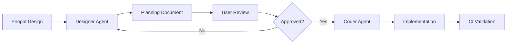

# AGENTS.md - FulgensUI Developer Guide

This file provides guidelines and commands for AI agents working in this repository.

## Project Overview

FulgensUI is a modern UI component library built with React 19, Vite, and PandaCSS. It's a monorepo managed with Turborepo using Bun as the package manager.

## Directory Structure

```text
FulgensUI/
├── packages/
│   ├── core/          # Main UI component library
│   │   ├── src/
│   │   │   ├── components/ui/{component-name}/  # Component files
│   │   │   ├── config/           # PandaCSS tokens, recipes, semantic tokens
│   │   │   └── styled-system/    # Generated PandaCSS output
│   │   └── .storybook/            # Storybook configuration
│   └── docsite/       # Docusaurus documentation site
├── turbo.json         # Turborepo configuration
└── package.json       # Root workspace config
```

## Commands

### Root Level (from project root)

```bash
# Install dependencies
bun install

# Run all packages in dev mode
bun run dev

# Build all packages
bun run build

# Lint all packages
bun run lint

# Test all packages
bun run test

# Clean all packages
bun run clean
```

### Core Package (packages/core)

```bash
cd packages/core

# Run Vite dev server
bun run dev

# Run Storybook (port 6006)
bun run storybook

# Build for production
bun run build

# Lint with ESLint
bun run lint

# Type check with TypeScript
bun run type-check

# Run a single test file
bunx vitest run path/to/testfile.test.ts

# Run tests in watch mode
bunx vitest

# Run tests with coverage
bunx vitest run --coverage
```

## Component Structure

New components should follow this structure:

```text
src/components/ui/{component-name}/
├── index.ts           # Barrel export
├── {component}.tsx    # Main component
├── config/
│   ├── {component}-recipe.ts        # PandaCSS recipe
│   └── {component}-semantic-tokens.ts # Semantic tokens (if needed)
└── storybook/
    ├── {component}.stories.tsx      # Storybook stories
    └── {component}.mdx              # Documentation
```

### Component File Pattern

```typescript
// packages/core/src/components/ui/button/button.tsx
import { ComponentProps } from "react";
import { button } from "@styled-system/recipes";
import type { ButtonVariantProps } from "@styled-system/recipes";

export type { ButtonVariantProps } from "@styled-system/recipes";

export type ButtonProps = ComponentProps<"button"> & ButtonVariantProps;

export function Button(props: ButtonProps) {
  return <button className={button({ ...props })} {...props}></button>;
}
```

### Index File Pattern

```typescript
// packages/core/src/components/ui/button/index.ts
export * from "./button";
```

## Code Style Guidelines

### TypeScript

- **Strict mode enabled** - No implicit any, strict null checks
- Use explicit types for function parameters and return values when not obvious
- Use `interface` for public APIs, `type` for unions/intersections
- Avoid `any` - use `unknown` when type is truly unknown

### Naming Conventions

- **Components**: PascalCase (e.g., `Button`, `Modal`)
- **Files**: kebab-case (e.g., `button.tsx`, `my-component.ts`)
- **Directories**: kebab-case (e.g., `ui/button/`)
- **Variables/functions**: camelCase
- **Constants**: UPPER_SNAKE_CASE
- **Types/Interfaces**: PascalCase with `Props` suffix (e.g., `ButtonProps`)

### Imports

Use path aliases when available:

```typescript
// Good
import { button } from "@styled-system/recipes";
import { Button } from "@components/ui/button";
import { colors } from "@config/base";

// Avoid
import { button } from "../../styled-system/recipes";
```

Configured aliases:

- `@/*` → `./src/*`
- `@styled-system/*` → `./src/styled-system/*`
- `@components/*` → `./src/components/*`
- `@config/*` → `./src/config/*`

### ESLint Rules

The project uses ESLint with these key rules:

- `no-unused-vars`: Error on unused variables (except those starting with `_`)
- React hooks rules from `eslint-plugin-react-hooks`
- React refresh rules from `eslint-plugin-react-refresh`

### Error Handling

- Use TypeScript types to prevent runtime errors
- Use early returns for error conditions
- Never use `any` type - use `unknown` instead

### PandaCSS Recipes

Components use PandaCSS recipes for variant styling:

```typescript
// packages/core/src/config/recipes.ts
import { defineRecipe } from "@pandacss/dev";

export const button = defineRecipe({
  className: "button",
  base: {
    display: "inline-flex",
    alignItems: "center",
    justifyContent: "center",
  },
  variants: {
    variant: {
      primary: { bg: "primary.500", color: "white" },
      secondary: { bg: "secondary.500", color: "white" },
    },
    size: {
      sm: { px: 3, py: 1 },
      md: { px: 4, py: 2 },
    },
  },
  defaultVariants: {
    variant: "primary",
    size: "md",
  },
});
```

## Testing

### Test Configuration Patterns

#### Packages Without Tests

For packages that don't require testing (e.g., documentation sites, configuration-only packages):

1. **Create package-specific turbo.json:**

   ```json
   {
     "$schema": "https://turbo.build/schema.json",
     "extends": ["//"],
     "tasks": {
       "test": {
         "cache": false,
         "outputs": []
       }
     }
   }
   ```

2. **Set test script to informative no-op:**

   ```json
   "test": "echo 'Package name has no tests - skipping'"
   ```

**Current packages using this pattern:**

- `@fulgensui/docsite` - Documentation site with no interactive components

**When to add tests:**

If the package later includes:

- Custom React components with logic
- Interactive demos or widgets
- Utility functions requiring validation

Then add vitest dependencies and proper test configuration.

### Vitest

Tests are co-located with components or in a `__tests__` directory:

```typescript
import { describe, it, expect } from "vitest";

describe("Button", () => {
  it("renders correctly", () => {
    // Test implementation
  });
});
```

Run a single test file:

```bash
cd packages/core
bunx vitest run src/components/ui/button/__tests__/button.test.tsx
```

### Storybook

Components should have Storybook stories for visual testing and documentation:

```typescript
// packages/core/src/components/ui/button/storybook/button.stories.tsx
import type { Meta, StoryObj } from "@storybook/react";
import { Button } from "../button";

const meta = {
  component: Button,
  tags: ["autodocs"],
} satisfies Meta<typeof Button>;

export default meta;
type Story = StoryObj<typeof meta>;

export const Primary: Story = {
  args: {
    children: "Click me",
    variant: "primary",
  },
};
```

## Linting & Type Checking

Always run lint and type check before committing:

```bash
cd packages/core
bun run lint
bun run type-check
```

## CI/CD

- **GitHub Actions**: Runs on push/PR to build core and deploy docsite using Bun 1.3.6
- **GitLab CI**: Full pipeline with build, test, and deployment

## Local CI Testing

FulgensUI provides atomic CI scripts that mirror the GitHub Actions pipeline for local testing before commits.

### CI Scripts

All CI scripts use the `ci:` prefix and can be run individually or as a full suite:

#### Individual Scripts

```bash
# Install dependencies (frozen lockfile, matches CI)
bun run ci:install

# Generate PandaCSS (required before other tasks)
bun run ci:panda

# Lint all packages
bun run ci:lint

# TypeScript type checking
bun run ci:type-check

# Run tests (fast, no coverage)
bun run ci:test

# Run tests with coverage (CI behavior)
bun run ci:test:coverage

# Build all packages
bun run ci:build

# Build Storybook
bun run ci:build-storybook
```

#### Full CI Suite

```bash
# Run complete CI pipeline locally
bun run ci:all
```

This executes all CI steps in order: install → panda → lint → type-check → test with coverage → build → build-storybook.

### Pre-commit Scripts

The pre-commit hook runs a subset of CI checks for faster feedback:

```bash
# Fast checks (no tests, no coverage)
bun run pre-commit:checks

# Interactive test runner (prompts on failure)
bun run pre-commit:test:staged
```

### Turbo Task Orchestration

CI scripts leverage Turborepo for task orchestration and caching:

**Task Dependency Chain:**

```
panda (generate PandaCSS)
  ↓
  ├→ lint
  ├→ type-check
  ├→ test
  └→ build
```

All tasks wait for PandaCSS generation to complete before running.

**Turbo Filtering:**

Run tasks only for affected packages:

```bash
# Test only affected packages
turbo run test --filter=[affected]

# Build specific package
turbo run build --filter=@fulgensui/core
```

### Coverage Thresholds

**Coverage thresholds are currently DISABLED** to allow incremental test development.

Coverage reports are still generated and viewable, but tests will pass regardless of coverage percentage. This allows:

- Gradual test addition as components are developed
- Focus on test quality over quantity
- Flexibility during rapid prototyping

To view coverage reports:

- Run `bun run ci:test:coverage` locally
- Check the coverage output in terminal
- View HTML reports in `packages/core/coverage/index.html`

**Re-enabling thresholds:** If you want to enforce coverage thresholds in the future, uncomment the `thresholds` section in `packages/core/vitest.config.ts`.

### Troubleshooting

**Pre-commit hook too slow?**

Skip the hook temporarily:

```bash
git commit --no-verify -m "your message"
```

Or remove `bun run pre-commit:test:staged` from `.husky/pre-commit` to disable tests.

**Tests failing in CI but passing locally?**

Ensure you're using frozen lockfile:

```bash
rm -rf node_modules bun.lock
bun install
bun run ci:all
```

**Turbo cache issues?**

Clear turbo cache:

```bash
rm -rf .turbo
bun run clean
```

## Git Hooks & Commit Workflow

### Husky

The project uses Husky for Git hooks with the following configuration:

- **pre-commit**:
  1. Runs `lint-staged` to format and fix staged files (eslint --fix, prettier)
  2. Runs `pre-commit:checks` for fast validation (panda, lint, type-check)
  3. Runs `pre-commit:test:staged` for interactive test runner on affected packages
- **commit-msg**: Validates commit messages against Conventional Commits format

### Pre-commit Hook Behavior

**What runs:**

1. **lint-staged** (~5-15s): Auto-fixes formatting issues in staged files
2. **pre-commit:checks** (~10-30s): Validates PandaCSS, linting, TypeScript types
3. **pre-commit:test:staged** (~10-60s): Runs tests on affected packages only

**If tests fail:**

- Hook prompts: `Tests failed. Continue with commit anyway? [y/N]`
- Press `y` to commit anyway (useful for WIP commits)
- Press `n` or Enter to abort commit and fix tests

**Total time:** ~25-105 seconds depending on changes

**Skip the hook:**

```bash
git commit --no-verify -m "wip: work in progress"
```

### lint-staged Configuration

Located in `.lintstagedrc`:

```json
{
  "*.{ts,tsx}": ["eslint --fix --max-warnings=0"],
  "*.{json,md,yml,yaml}": ["prettier --write"]
}
```

### Conventional Commits

All commit messages must follow the Conventional Commits specification:

```
type(scope): description

[optional body]

[optional footer]
```

**Types:**

- `feat`: A new feature
- `fix`: A bug fix
- `docs`: Documentation only changes
- `style`: Changes that do not affect the meaning of the code (formatting)
- `refactor`: Code change that neither fixes a bug nor adds a feature
- `perf`: Code change that improves performance
- `test`: Adding missing tests or correcting existing tests
- `build`: Changes that affect the build system or external dependencies
- `ci`: Changes to CI configuration files and scripts
- `chore`: Other changes that don't modify src or test files
- `revert`: Reverts a previous commit

**Examples:**

```
feat(button): add primary variant with hover state
fix(input): resolve value not updating on change
docs(readme): update installation instructions
```

### OpenCode Slash Commands

This repository uses OpenCode custom slash commands for enhanced Git workflows. These are **agent-based workflows** defined in `.opencode/commands/`, not npm scripts.

**Available Commands:**

#### `/prepare-commit` - Prepare Commit with Validation

Prepares a commit by running tests, linting, and generating an AI commit message.

**How it works:**

1. Analyzes staged files and current branch
2. Extracts issue number from branch name (e.g., `feature/123-name` → `#123`)
3. Determines commit type (branch prefix → GitHub labels → file analysis)
4. Runs tests with coverage (scoped to affected packages)
5. Runs ESLint validation
6. Generates AI commit message using Ollama (`opencode/big-pickle` model)
7. Saves message to `.temp/commit-messages/<details>_<timestamp>.txt`
8. Creates log file in `logs/` directory

**Usage:**

```bash
/prepare-commit              # Full workflow
/prepare-commit --dry-run    # Test run without saving files
```

**Requirements:**

- Ollama running with `opencode/big-pickle` model
- Staged files ready to commit
- Optional: GitHub CLI (`gh`) for PR label detection

**Output:**

- Commit message file: `.temp/commit-messages/<issue#>_<type>_<name>_<timestamp>.txt`
- Log file: `logs/prepare-commit_<status>_<timestamp>.log`

---

#### `/make-commit` - Create Commit from Prepared Message

Creates a Git commit using a prepared message file from `/prepare-commit`.

**How it works:**

1. Lists available message files in `.temp/commit-messages/`
2. Presents interactive selection (or accepts filename as argument)
3. Reads and sanitizes message (removes comment lines)
4. Executes `git commit` with the message
5. Creates log file with commit details
6. Archives used message file

**Usage:**

```bash
/make-commit                                    # Interactive selection
/make-commit 123_feat_add-button_<timestamp>.txt  # Direct file usage
```

**Requirements:**

- Prepared message file from `/prepare-commit`
- Staged files ready to commit

**Output:**

- Commit created with SHA
- Log file: `logs/make-commit_<status>_<timestamp>.log`
- Message file archived to `.temp/commit-messages/archive/`

---

#### `/commit` - Quick Commit Workflow

One-step commit workflow combining preparation and commit creation.

See `.opencode/commands/commit.md` for details.

---

**Implementation Details:**

These commands are implemented as **agent workflows** (markdown files in `.opencode/commands/`) that execute bash commands dynamically through the git subagent. They are NOT standalone TypeScript scripts or npm scripts.

**Why Agent Workflows?**

- Dynamic execution based on repository state
- Interactive prompts and user feedback
- Flexible logic without rigid scripts
- Better error handling and recovery
- Access to full AI agent capabilities

**Related Scripts:**

- `scripts/ai-commit-agent.ts` - Standalone AI commit helper (used by `/prepare-commit`)
- `bun run ai-commit` - Direct npm script for quick commits (legacy, simpler workflow)

### AI Commit Agent

The project includes an AI-powered commit agent that helps generate conventional commit messages.

**Usage:**

```bash
bun run ai-commit
```

**How it works:**

1. **Staged Files**: Analyzes which files are staged for commit
2. **Issue Detection**: Extracts issue ID from branch name (e.g., `feature/123-add-button` → `#123`)
3. **Test Execution**: Runs tests with coverage (scoped to affected package when possible)
4. **AI Generation**: Uses Ollama with `opencode/big-pickle` model to generate commit message
5. **Review**: Opens editor for user to review/edit the generated message
6. **Commit**: Creates the commit when user saves and closes the editor

**Coverage Requirements:**

- **Branch**: 100% (default threshold)
- **Line**: 90% (default threshold)

The agent displays coverage metrics before committing, allowing you to make an informed decision about whether to proceed.

**Branch Naming for Issue Tracking:**

Create branches with issue IDs using these patterns:

- `feature/123-add-button`
- `fix/456-hover-issue`
- `tasks/789-update-docs`

### Git Subagent for Committing

When asked to commit changes, the git subagent should:

1. **Check staged files**: `git diff --cached --name-only`
2. **Determine scope**: Identify which package/component is affected
3. **Run tests**: Execute tests for the affected package (or all tests if integration tests needed)
4. **Discuss coverage**: Review coverage metrics with user - are thresholds met?
5. **Generate message**: Use `bun run ai-commit` or manually craft a conventional commit
6. **Validate format**: Ensure commit follows Conventional Commits specification
7. **Allow edits**: Give user opportunity to edit the commit message if needed

**Test Scope Selection:**

- Package-scoped changes: Run tests only for that package
- Integration/breaking changes: Run full test suite
- Ask user if unsure about required test scope

## Pull Request Templates

FulgensUI provides specialized PR templates that integrate with the issue system, CI pipeline, agent workflow, and label automation.

### Available Templates

The repository includes **6 specialized templates** plus a default fallback:

1. **feature.md** - New features (`type:feat`) - Most comprehensive
2. **bugfix.md** - Bug fixes (`type:fix`) - Reproduction-focused
3. **docs.md** - Documentation (`type:docs`) - Lightweight
4. **refactor.md** - Refactoring (`type:refactor`) - Moderate
5. **performance.md** - Performance improvements (`type:perf`) - Metrics-focused
6. **chore.md** - Maintenance (`type:chore`, `type:build`, `type:ci`, `type:test`) - Minimal
7. **pull_request_template.md** (default) - General-purpose fallback

**Location:** `.github/PULL_REQUEST_TEMPLATE/`

### Usage

#### Via URL Parameter (Recommended)

When creating a PR via GitHub UI, append `?template={name}` to the URL:

```
https://github.com/0xbaitan/FulgensUI/compare/main...feat/123?template=feature.md
https://github.com/0xbaitan/FulgensUI/compare/main...fix/456?template=bugfix.md
```

#### Via GitHub CLI

```bash
gh pr create --template .github/PULL_REQUEST_TEMPLATE/feature.md
gh pr create --template .github/PULL_REQUEST_TEMPLATE/bugfix.md
```

#### Default Template

If no `?template=` parameter is specified, GitHub loads `.github/pull_request_template.md` (uses feature.md content).

### Template Structure

All templates include these common sections:

#### 1. Type & Summary

- Checkbox for PR type (feat, fix, docs, etc.)
- One-line summary (max 120 chars)
- Aligns with conventional commit format

#### 2. Related Issues

- Auto-close syntax: `Closes #123`, `Fixes #456`
- Links to GitHub issues
- Triggers auto-close on merge

#### 3. Breaking Changes

- Detection of breaking changes
- Migration guide for users
- Versioning impact (MAJOR vs MINOR bump)

#### 4. Changes Section

- Component files affected
- PandaCSS recipes/tokens modified
- Storybook stories added
- Template-specific (varies by type)

#### 5. CI Validation Checklist

Mirrors the exact `bun run ci:all` pipeline:

```markdown
- [ ] ✅ PandaCSS Generation (`bun run ci:panda`)
- [ ] ✅ ESLint (`bun run ci:lint`)
- [ ] ✅ TypeScript (`bun run ci:type-check`)
- [ ] ✅ Tests with Coverage (`bun run ci:test:coverage`)
- [ ] ✅ Build (`bun run ci:build`)
- [ ] ✅ Storybook Build (`bun run ci:build-storybook`)
```

**Note:** Coverage thresholds are DISABLED, but metrics are still informative.

#### 6. Testing Details

- Coverage metrics (optional/informational)
- Test cases implemented
- Manual testing performed
- Edge cases covered

#### 7. Documentation

- Storybook stories added
- README/AGENTS.md updates
- Component exports updated
- Storybook preview link

#### 8. Agent Workflow Integration

Links to agent-generated planning documents:

```markdown
**Agent workflow used:**

- [ ] @architect - Created IMPLEMENTATION-PLAN.md
- [ ] @designer - Created COMPONENT-PLAN.md (if UI)
- [ ] @coder - Executed via TDD workflow

**Specs references:**

- specs/architecture/{issue}/IMPLEMENTATION-PLAN.md
- specs/{branch}/{component}/COMPONENT-PLAN.md
```

#### 9. Visual Changes (if applicable)

- Screenshots (before/after)
- Storybook preview link
- Responsive behavior demos

#### 10. Suggested Labels

Aligns with `.github/labels.yml`:

```markdown
- type:feat (or appropriate type)
- status:review
- estimate:X (Fibonacci: 1,2,3,5,8,13,21,34,55,89)
- scope:core or scope:docsite
- priority:must-have/should-have/could-have/won't-have
```

#### 11. Reviewer Checklist

- TDD compliance (Red → Green → Refactor)
- SOLID principles verification
- Minimal changes (no scope creep)
- Test coverage adequate
- Architecture docs accurate

#### 12. Pre-Merge Checklist

- All CI checks pass
- Approval received
- Labels applied
- Issue will auto-close

### Template Specializations

#### feature.md (Most Comprehensive)

**Use for:** New components, features, capabilities

**Unique sections:**

- Component file structure (all files required)
- PandaCSS recipe specification
- Storybook story requirements
- All variants/states documented

**Typical estimate:** 5-13 points

---

#### bugfix.md (Reproduction-Focused)

**Use for:** Bug fixes

**Unique sections:**

- **Reproduction steps** (step-by-step)
- **Expected vs Actual behavior**
- **Environment details** (browser, OS, version)
- **Root cause analysis** (code-level explanation)
- **Regression test requirement** (must add test)

**Typical estimate:** 1-5 points

---

#### docs.md (Lightweight)

**Use for:** Documentation-only changes

**Reduced CI checks:**

- Skips test coverage (optional for docs)
- Skips Storybook build (unless docs include examples)

**Unique sections:**

- Type of documentation (API, usage, migration, architecture)
- Links verified
- Code examples tested (if applicable)

**Typical estimate:** 1-2 points

---

#### refactor.md (Moderate)

**Use for:** Code improvements without behavior change

**Unique sections:**

- **SOLID improvements** (which principles applied)
- **Behavior verification** (no changes guarantee)
- **Coverage maintained** (before/after comparison)
- **Code metrics** (LOC reduction, complexity reduction)

**Critical requirement:** All existing tests must pass without modification

**Typical estimate:** 2-8 points

---

#### performance.md (Metrics-Focused)

**Use for:** Performance optimizations

**Unique sections:**

- **Performance metrics** (before/after)
  - Rendering time (ms)
  - Bundle size (KB)
  - User interaction latency (ms)
  - Lighthouse scores
- **Benchmark results** (Vitest benchmarks)
- **Measurement method** (tools used, test environment)
- **Optimization technique** (memoization, virtualization, code splitting, etc.)

**Typical estimate:** 3-8 points

---

#### chore.md (Minimal)

**Use for:** Dependencies, configs, build system, CI, tests

**Multi-type checkbox:**

- `type:chore` - Other changes
- `type:build` - Build system
- `type:ci` - CI/CD changes
- `type:test` - Test changes

**Unique sections:**

- Dependencies updated (with versions)
- Config changes (what and why)
- No unintended side effects verification

**Typical estimate:** 1-2 points

---

### Integration with Existing Workflows

#### Label Automation

PR templates suggest labels that align with `.github/labels.yml`:

- **Status labels** - Workflow transitions (`status:review` → `status:qa` → `status:done`)
- **Type labels** - Conventional commit types (`type:feat`, `type:fix`, etc.)
- **Priority labels** - MoSCoW prioritization (`priority:must-have`, etc.)
- **Estimate labels** - Fibonacci sequence (`estimate:1`, `estimate:2`, etc.)
- **Scope labels** - Package affected (`scope:core`, `scope:docsite`)

GitHub Actions enforce mutual exclusivity and validate transitions automatically.

#### Agent Workflow

Templates reference agent outputs:

1. **@manager** - Creates GitHub issue (`.temp/issues/specs/`)
2. **@architect** - Creates IMPLEMENTATION-PLAN.md (`specs/architecture/{issue}/`)
3. **@designer** - Creates COMPONENT-PLAN.md (`specs/{branch}/{component}/`) (if UI)
4. **@coder** - Executes implementation via 8-phase TDD workflow
5. **Create PR** - Use appropriate template
6. **Review** - Checklist validates TDD/SOLID compliance
7. **Merge** - Issue auto-closes, workflow complete

#### CI Pipeline

Template checklists mirror exact `ci:all` script from `package.json`:

```json
{
  "ci:all": "npm-run-all ci:install ci:panda ci:lint ci:type-check ci:test:coverage ci:build ci:build-storybook"
}
```

Each checkbox corresponds to one script, ensuring no checks are missed.

#### Commit Message Integration

Templates reference conventional commit format:

```
{type}({scope}): {description}

{optional body}

BREAKING CHANGE: {description} (if applicable)
```

Breaking change section in template maps directly to commit footer.

### Template Selection Guide

**Quick reference:**

| PR Type               | Template         | Typical Estimate | Key Validation                          |
| --------------------- | ---------------- | ---------------- | --------------------------------------- |
| New component/feature | `feature.md`     | 5-13 points      | All variants, Storybook, TDD            |
| Bug fix               | `bugfix.md`      | 1-5 points       | Regression test, root cause             |
| Documentation         | `docs.md`        | 1-2 points       | Links valid, examples work              |
| Code improvement      | `refactor.md`    | 2-8 points       | No behavior change, coverage maintained |
| Performance           | `performance.md` | 3-8 points       | Metrics improved, benchmarks added      |
| Dependencies/config   | `chore.md`       | 1-2 points       | No side effects                         |

**When in doubt:** Use the default template (covers all bases).

### Tips for Reviewers

When reviewing PRs, verify:

1. **Template used correctly** - Type matches content
2. **All checklists complete** - No skipped sections
3. **CI passes** - All 6 checks green
4. **Specs linked** - Architecture/component plans referenced
5. **Labels applied** - Align with `.github/labels.yml`
6. **Issue will close** - `Closes #123` syntax present
7. **Breaking changes documented** - Migration guide provided (if applicable)
8. **Coverage acceptable** - Metrics visible even if thresholds disabled
9. **TDD followed** - Tests exist for new code (feature/bugfix)
10. **SOLID compliant** - Code follows best practices (feature/refactor)

### Tips for Contributors

**Before creating PR:**

1. Run `bun run ci:all` locally - catch issues early
2. Link issue in branch name - enables auto-close (`feature/123-add-button`)
3. Use `/prepare-commit` - generates AI commit message
4. Review architecture docs - ensure alignment with plan

**Choosing the right template:**

- If adding functionality → `feature.md`
- If fixing broken behavior → `bugfix.md`
- If changing structure/quality → `refactor.md`
- If improving speed/size → `performance.md`
- If updating docs → `docs.md`
- If updating tooling → `chore.md`

**Filling out the template:**

- ✅ Complete ALL sections (no skipping)
- ✅ Check ALL checkboxes (or mark N/A)
- ✅ Provide metrics (coverage, performance, bundle size)
- ✅ Link specs (IMPLEMENTATION-PLAN.md, COMPONENT-PLAN.md)
- ✅ Add screenshots (for UI changes)
- ✅ Suggest labels (helps maintainers)

**Common mistakes:**

- ❌ Using default template for specialized PR (use specific template)
- ❌ Skipping CI validation checklist (must verify all checks)
- ❌ No issue link (prevents auto-close)
- ❌ Breaking changes without migration guide
- ❌ No tests for new code (TDD required)
- ❌ Missing Storybook stories (required for UI components)

### Example Workflows

#### Creating a Feature PR

```bash
# 1. Create feature branch
git checkout -b feature/130-dark-mode-toggle

# 2. Implement feature (following IMPLEMENTATION-PLAN.md)
# ... (via @coder agent or manually)

# 3. Run CI locally
bun run ci:all

# 4. Commit changes
/prepare-commit  # Or: git add . && git commit -m "feat(toggle): ..."

# 5. Push branch
git push -u origin feature/130-dark-mode-toggle

# 6. Create PR with feature template
gh pr create --template .github/PULL_REQUEST_TEMPLATE/feature.md

# 7. Fill out template, submit for review
```

#### Creating a Bug Fix PR

```bash
# 1. Create fix branch
git checkout -b fix/125-button-hover-bug

# 2. Add regression test (RED)
# ... write failing test

# 3. Fix bug (GREEN)
# ... implement fix

# 4. Run CI locally
bun run ci:all

# 5. Commit changes
/prepare-commit

# 6. Push and create PR
git push -u origin fix/125-button-hover-bug
gh pr create --template .github/PULL_REQUEST_TEMPLATE/bugfix.md
```

### Maintenance

**Adding new templates:**

1. Create `.github/PULL_REQUEST_TEMPLATE/{name}.md`
2. Follow existing structure (11 sections)
3. Include CI validation checklist
4. Link to agent workflow specs
5. Suggest appropriate labels
6. Update this AGENTS.md section

**Updating existing templates:**

1. Edit `.github/PULL_REQUEST_TEMPLATE/{name}.md`
2. Ensure CI checklist matches `package.json` scripts
3. Verify label suggestions align with `.github/labels.yml`
4. Test template by creating sample PR
5. Update documentation if structure changed

**Template best practices:**

- Keep sections consistent across templates
- Use checkboxes for actionable items
- Provide examples in comments
- Link to relevant documentation
- Keep concise (max 250 lines per template)

## Designer-to-Coder Workflow

FulgensUI uses a two-agent workflow for implementing components from Penpot designs:

### Overview



### When to Use

Use the designer agent when:

- You have a component designed in Penpot that needs implementation
- You want to document design specifications before coding
- You need design validation (spacing grid, color tokens, accessibility)
- You want a structured plan for another developer or agent to follow

### Step-by-Step Process

#### 1. Invoke Designer Agent

```
User: "I designed a Button component in Penpot. Create a plan for implementing it."
```

The designer agent will:

- Read the Penpot file and extract specifications
- Map design values to PandaCSS tokens
- Validate against FulgensUI standards (spacing grid, contrast, states)
- Export assets (screenshots, measurements)
- Generate a comprehensive planning document

#### 2. Review Planning Document

The designer agent creates: `specs/<feature-branch>/<component-name>/COMPONENT-PLAN.md`

**Review checklist:**

- [ ] All Penpot measurements accurately captured
- [ ] Color token mappings are correct
- [ ] Interactive states (hover/focus/active/disabled) documented
- [ ] Accessibility contrast ratios meet WCAG AA
- [ ] Spacing values align to 4px/8px grid
- [ ] File structure follows FulgensUI conventions
- [ ] PandaCSS recipe structure is clear and complete

#### 3. Approve or Request Changes

If plan looks good:

```
User: "Looks good, approve it"
```

Designer agent updates status to `APPROVED` in the planning document.

If changes needed:

```
User: "The hover state should use primary.600 instead. Update the plan."
```

Designer agent revises the document and presents updated version.

#### 4. Implement with Coder Agent

Once approved, hand off to implementation:

```
User: "Now implement the button based on this plan"
```

Or invoke a coding agent directly:

```
User: "Implement the component from specs/feature-123/button/COMPONENT-PLAN.md"
```

The coder agent will:

1. Read the planning document
2. Create directory structure
3. Implement PandaCSS recipe
4. Implement React component
5. Write tests (Vitest)
6. Create Storybook stories
7. Run CI validation
8. Mark checklist items complete

### Designer Agent Boundaries

**The designer agent ONLY creates specifications. It does NOT:**

❌ Write TypeScript/React code  
❌ Run builds, tests, or git operations  
❌ Modify Penpot shapes or design elements  
❌ Install dependencies  
❌ Commit files

**The designer agent DOES:**

✅ Read Penpot files  
✅ Extract measurements and design tokens  
✅ Validate designs against standards  
✅ Export assets (PNG, SVG)  
✅ Generate markdown planning documents  
✅ Calculate accessibility metrics  
✅ Propose new tokens when needed  
✅ Write design tokens to Penpot (with user permission)  
✅ Create token sets and themes in Penpot  
✅ Sync PandaCSS tokens to Penpot catalog

### Token Synchronization

The designer agent can sync design tokens between PandaCSS and Penpot:

**Workflow:**

1. Designer agent extracts colors/values from Penpot design
2. Compares against PandaCSS config (`packages/core/src/config/base/colors.ts`)
3. Identifies missing tokens in Penpot
4. Asks user permission to create tokens
5. Executes token creation via Penpot MCP server
6. Verifies creation and documents results in planning doc section 3.5

**User approval required:**

- Designer agent always asks before creating/modifying tokens
- User can approve, decline, or request to see code first
- Valid responses: "yes", "create them", "show me the code first", "skip"

**Source of truth:**

- PandaCSS config is authoritative
- Tokens sync FROM PandaCSS TO Penpot
- Penpot-only tokens are informational (not synced back)

**Token organization:**

- All tokens in single set: `FulgensUI`
- Hierarchical naming: `colors/primary/500`, `spacing/md`, etc.
- Theme support: `FulgensUI/Light`, `FulgensUI/Dark`, custom themes

**Error handling:**

- If token creation fails, document in planning doc
- Continue with rest of planning process
- User can manually create tokens or retry later

**Example workflow:**

```
Designer: I analyzed the Button component and found 3 colors used.
          Token status:
          ✅ #3B82F6 exists in Penpot as colors/primary/500
          ❌ #2563EB missing from Penpot (PandaCSS has blue.600)
          ❌ #1E40AF missing from Penpot (PandaCSS has blue.800)

          Create 2 missing tokens in Penpot?
User: yes, create them
Designer: ✅ Created colors/primary/600 and colors/primary/800
          Token set "FulgensUI" is now active
          Updated planning document with sync status
```

**Documentation:**

- [Token Sync Examples](specs/examples/token-sync/README.md)
- [Code Snippets](specs/examples/token-sync/code-snippets.md)
- [Designer Agent Config](.opencode/agents/designer.md#token-synchronization-workflow)

### Planning Document Structure

Every planning document includes:

1. **Component Overview** - Purpose, Penpot reference
2. **File Structure** - Exact paths and naming conventions
3. **Design Tokens** - Color, spacing, typography mappings
   3.5. **Token Synchronization** - Penpot token sync status and results
4. **PandaCSS Recipe** - Complete recipe specification
5. **Component Props** - TypeScript prop types
6. **Accessibility Requirements** - ARIA, keyboard, contrast validation
7. **Test Specifications** - Required test cases
8. **Storybook Stories** - Story definitions and variants
9. **Design Validation Report** - Spacing, colors, contrast, states, responsive
10. **Implementation Checklist** - Step-by-step tasks for coder
11. **Assets** - Exported screenshots and diagrams
12. **Notes & Decisions** - Design rationale and guidance

### Example Planning Document

See reference example: `specs/examples/button/COMPONENT-PLAN.md`

This shows a complete planning document with:

- Realistic Penpot measurements
- Color token mappings
- Validation reports
- Complete PandaCSS recipe structure
- Test and Storybook specifications

### Design Validation Rules

The designer agent validates:

**1. Spacing Grid Adherence**

- All spacing must be multiples of 4px
- Flags non-compliant values (e.g., 13px, 17px)

**2. Color Token Compliance**

- No hard-coded hex colors in recipes
- All colors must map to `colors.*` tokens
- Proposes new tokens with justification if needed

**3. Accessibility Contrast**

- Calculates WCAG contrast ratios
- Requires 4.5:1 for normal text (AA)
- Requires 3:1 for large text and UI components (AA)

**4. Interactive State Coverage**

- Hover, focus, active, disabled states required
- Validates all states defined in Penpot

**5. Responsive Design**

- Documents breakpoints if present
- Notes fixed vs. fluid sizing

### Naming Conventions

**From Penpot to Files (kebab-case):**

- `ButtonPrimary` → `button.tsx`
- `Input Field` → `input-field.tsx`
- `DropdownMenu` → `dropdown-menu.tsx`

**Component names (PascalCase):**

- `Button`, `InputField`, `DropdownMenu`

**Recipe files:**

- `button-recipe.ts`, `input-field-recipe.ts`

**Planning documents:**

- `COMPONENT-PLAN.md` (always uppercase)

### File Locations

```
specs/<feature-branch>/<component-name>/
├── COMPONENT-PLAN.md          # Comprehensive planning document
└── assets/
    ├── <component>-default.png      # Default state screenshot
    ├── <component>-variants.png     # All variants side-by-side
    ├── <component>-states.png       # Interactive states
    └── <component>-measurements.svg # Spacing annotations (optional)
```

### Invoking the Agents

**Designer Agent:**

```
@designer Create a planning document for the Button component in Penpot
```

**Coder Agent (general):**

```
@general Implement the component from specs/feature-123/button/COMPONENT-PLAN.md
```

### Integration with Git Workflow

**Recommended branch naming:**

```
feature/<issue-number>-<component-name>
```

Example: `feature/123-add-button`

**Workflow:**

1. Create feature branch
2. Designer agent generates plan in `specs/feature-123-add-button/button/`
3. Review and approve plan
4. Coder agent implements component
5. Run `bun run ci:all` to validate
6. Commit with conventional commit message
7. Create PR referencing planning document

### Tips

**For best results:**

- Ensure Penpot designs include all interactive states
- Use clear, descriptive layer names in Penpot
- Annotate breakpoints or responsive behavior in Penpot
- Include hover/focus/active/disabled state frames
- Use consistent spacing (4px/8px grid)

**Common issues:**

- **Missing states**: Add hover/focus/disabled frames in Penpot
- **Non-standard spacing**: Designer agent will flag and recommend fixes
- **Color mismatches**: Designer agent proposes new tokens or maps to existing
- **Low contrast**: Designer agent calculates ratios and flags WCAG failures

## Manager Agent (@manager)

The @manager agent is a SCRUM specialist that helps create atomic, well-refined GitHub issue tickets through conversational refinement.

### When to Use @manager

Use @manager when you need to:

- Create a new GitHub issue (bug, story, epic, task, or item)
- Refine issue requirements through conversation
- Break down large features into atomic tickets
- Ensure issues follow SCRUM best practices
- Get help with acceptance criteria and edge cases

### Quick Start

**Create a bug:**

```
@manager I found a bug where the button hover state doesn't work in dark mode
```

**Create a story:**

```
@manager Create a story for adding keyboard navigation to the dropdown component
```

**Create an epic:**

```
@manager I want to create an epic for building a complete form system
```

### How @manager Works

1. **Conversation-based refinement**: Ask questions to gather all necessary details
2. **Proactive guidance**: Suggests edge cases, testing criteria, accessibility considerations
3. **Atomicity enforcement**: Detects when tickets are too large and suggests breakdown
4. **Conciseness enforcement**: Keeps tickets short and focused (<120 char titles, <500 char sections)
5. **GitHub integration**: Generates specs with all labels and project field metadata
6. **Session persistence**: Saves conversation history for later restoration

### Invocation Patterns

**With type specified:**

```
@manager bug: Button hover doesn't work
@manager story: Add dark mode support
@manager task: Refactor button recipe
@manager epic: Build design system foundation
```

**General (type determined from conversation):**

```
@manager I need to create an issue for...
```

### Issue Types

#### Bug

For defects or incorrect behavior:

- **Structure**: Feature, Scenario, Expected/Actual behavior, Environment
- **Acceptance Criteria**: Checklist of verification steps
- **Required**: Reproduction steps, environment details

#### Story

For user-facing features:

- **Structure**: User story, Acceptance criteria (Gherkin), Background
- **Acceptance Criteria**: Gherkin scenarios (Given/When/Then)
- **Required**: Clear user goal and persona

#### Epic

For large initiatives (no implementation details):

- **Structure**: Goal, Stakeholder, Scope, Milestones
- **Acceptance Criteria**: High-level success criteria
- **Note**: Epics don't have subtasks; create separate items instead

#### Task

For technical/internal work:

- **Structure**: Technical context, Implementation approach, Dependencies, Test criteria
- **Acceptance Criteria**: Checklist of completion criteria
- **Required**: Clear technical scope

#### Item

For small, atomic work units:

- **Structure**: Description, Acceptance criteria, Notes
- **Acceptance Criteria**: Simple checklist
- **Use when**: Breaking down epics, small enhancements, simple fixes

### Atomicity & Breakdown

@manager enforces atomic tickets using these rules:

**Triggers for breakdown:**

- More than 8 subtasks needed
- Multiple components affected ("all components", "entire app")
- Sections exceed 500 characters
- Multiple user personas or scenarios
- Cross-cutting concerns (e.g., "add feature X to all pages")

**When breakdown suggested:**

- @manager recommends creating an Epic + separate Items
- Each item should be independently implementable
- Items use `has-parent` label to link to epic

### Conciseness Rules

**Strict limits:**

- Title: Max 120 characters
- Sections: Max 500 characters each
- Subtasks: Max 8 items
- If exceeded, @manager suggests splitting

**Writing style:**

- Active voice, present tense
- No filler words or preamble
- Bullet points over paragraphs
- Code examples when helpful

### Session Management

**Auto-save:**

- Every conversation is saved to `.temp/issues/sessions/{session_id}.json`
- Includes all messages, metadata, and spec path
- Persists until explicitly archived

**Restore a session:**

```bash
/restore-session --list                    # List all sessions
/restore-session 20260306_123456          # Restore specific session
```

**Session includes:**

- Full conversation history
- Current issue type and phase
- Attachments (screenshots, logs)
- Draft spec path

### GitHub Integration

**Spec output:**

- Saved to `.temp/issues/specs/{timestamp}_{type}_{title}.md`
- Contains frontmatter with all metadata
- Includes GitHub metadata comment for `/create-issue`

**Creating the issue:**

```bash
/create-issue .temp/issues/specs/20260306_123456_button-bug.md
/create-issue <file> --dry-run            # Preview without creating
```

**Labels automatically applied:**

- `status:backlog` (initial status)
- `issue:{type}` (bug, story, epic, task, item)
- `priority:{level}` (must-have, should-have, could-have, won't-have)
- `estimate:{points}` (Fibonacci: 1, 2, 3, 5, 8, 13, 21, 34, 55, 89)
- `scope:{package}` (core, docsite, none)
- `blocked` (if blocked_by is set)
- `has-parent` (if parent_link is set)

**Project fields populated:**

- Status: Todo
- Priority: From frontmatter
- Story points: From estimate
- Issue type: From frontmatter

### Attachments

**Request attachments:**

- @manager proactively asks for screenshots, logs, recordings
- Saves to `.temp/issues/attachments/{session_id}/`
- References in spec body

**Supported formats:**

- Images: PNG, JPG, GIF (for UI bugs)
- Videos: MP4, MOV (for repro steps)
- Logs: TXT, JSON (for errors)

### Examples

See `.opencode/examples/manager/` for:

- `bug-button-hover.md` - Bug ticket example
- `story-dark-mode.md` - Story with Gherkin criteria
- `epic-design-system.md` - Epic with milestones
- `README.md` - Conversation flow examples

### Workflow Integration

**With feature branches:**

```
1. Create branch: feature/123-dark-mode
2. @manager Create a story for dark mode support
3. [Refine through conversation]
4. /create-issue .temp/issues/specs/...
5. Implement feature
6. Reference issue in commit: "feat(theme): implement dark mode (#123)"
```

**With designer agent:**

```
1. @designer Read Penpot design for Button component
2. [Designer creates planning doc]
3. @manager Create a story for implementing the Button component
4. [Reference planning doc in story background]
5. /create-issue <spec>
```

### Tips

**For best results:**

- Provide context upfront (component name, user goal, environment)
- Share screenshots/logs proactively
- Answer questions completely
- Review generated spec before creating issue
- Use `--dry-run` to preview

**Common patterns:**

- Break large features into Epic + Items (not monolithic stories)
- Use Stories for user-facing features, Tasks for internal work
- Keep Items small (1-3 story points ideal)
- Always include test criteria in acceptance criteria

### Configuration

**Metadata files:**

- `.opencode/agents/manager.md` - Agent definition
- `.opencode/config/manager/core-rules.yaml` - Base behavior
- `.opencode/config/manager/github-metadata.yaml` - Labels/fields
- `.opencode/config/manager/conciseness-rules.yaml` - Length limits

**Type-specific rules:**

- `.opencode/prompts/manager/bug-rules.md`
- `.opencode/prompts/manager/story-rules.md`
- `.opencode/prompts/manager/epic-rules.md`
- `.opencode/prompts/manager/task-rules.md`
- `.opencode/prompts/manager/item-rules.md`

**Templates:**

- `.opencode/templates/manager/spec-{type}.md`

## Architect Agent (@architect)

The @architect agent is a development planning specialist that creates comprehensive implementation plans for GitHub issues. It analyzes technical feasibility, validates atomicity, delegates to specialized agents when needed, and generates step-by-step plans that coder agents can execute.

### When to Use @architect

Use @architect when you need to:

- Plan implementation for a GitHub issue (bug, story, task, item)
- Analyze technical feasibility before starting work
- Break down complex issues into subtasks with dependencies
- Get a structured implementation checklist
- Validate that an issue is atomic and implementable
- Coordinate between designer and coder agents

### Quick Start

**Plan a bug fix:**

```
@architect 125
```

**Plan a story implementation:**

```
@architect #130
```

**Plan with explicit mention:**

```
@architect Can you create an implementation plan for issue #125?
```

### How @architect Works

The architect agent follows a 7-step workflow:

1. **Issue Ingestion**: Fetches GitHub issue with labels, body, acceptance criteria, subtasks
2. **Validation**: Checks technical feasibility (files exist, no breaking changes, test coverage)
3. **Atomicity Check**: Detects if issue is too large (>8 steps, >13 points, cross-cutting concerns)
4. **Codebase Analysis**: Explores affected files, imports, integration points
5. **Delegation**: Asks user before delegating UI components to @designer
6. **Plan Creation**: Generates IMPLEMENTATION-PLAN.md with 11 comprehensive sections
7. **Subtask Plans**: Creates separate plans for each subtask with dependencies

### Invocation Patterns

**Natural language with issue number:**

```
@architect 125
@architect #130
@architect issue 125
@architect Can you plan issue #130?
```

**Direct mention (required):**

- Issue number detection is automatic (searches for `#123`, `issue 123`, `#123`)
- But `@architect` mention is REQUIRED - no auto-triggering
- Use explicit `@architect` in your message

### Validation Status Levels

**GREEN (✅)**: All checks passed, ready to implement

- Files exist
- No breaking changes detected
- Test coverage adequate
- TypeScript types compatible

**YELLOW (⚠️)**: Warnings present, review before proceeding

- Missing test coverage
- Minor breaking changes
- Type compatibility issues
- Integration complexity

**RED (🚫)**: Blockers detected, cannot proceed

- Critical files missing
- Major breaking changes
- Type safety violations
- Dependency conflicts

**On RED status:** Architect asks user how to proceed (doesn't auto-block)

### Atomicity Enforcement

The architect agent automatically detects non-atomic issues using these signals:

**Thresholds:**

- Steps: >8 implementation steps
- Story points: >13 points
- Packages: Affects 2+ packages
- Components: Affects 3+ components

**Complexity Signals:**

- Cross-cutting keywords: "all components", "entire app", "system-wide"
- Scope indicators: "multiple", "various", "across"
- Integration patterns: "integrate X with Y", "connect A to B"
- Volume indicators: "comprehensive", "complete", "full"

**When 2+ signals detected:** Offers three options:

1. **Convert to Epic**: Break into multiple items
2. **Narrow Scope**: Reduce to single component/feature
3. **Continue Anyway**: Proceed with complex implementation (user decides)

### Delegation Protocol

**Designer delegation:**

- Triggered when: New UI component, visual design, layout changes
- Always asks user first: "Should I delegate UI planning to @designer?"
- User must approve before delegating
- References COMPONENT-PLAN.md in implementation plan

**Explorer auto-delegation:**

- Triggered when: Large codebase analysis needed, many files to search
- NO approval needed (automatic delegation)
- Returns analysis results to continue planning

### Output Structure

**Main plan:** `specs/architecture/{issue-number}/IMPLEMENTATION-PLAN.md`

Contains 11 sections:

1. **Overview** - Issue summary, acceptance criteria, scope
2. **Scope** - In-scope/out-of-scope boundaries
3. **Codebase Analysis** - Files affected, imports, integration points
4. **Feasibility** - Validation status (GREEN/YELLOW/RED), risk assessment
5. **Delegation** - Designer/explorer delegation status and references
6. **Implementation Checklist** - 5-phase step-by-step guide (Setup → Implementation → Testing → Documentation → Validation)
7. **Subtasks** - Links to subtask plans with estimates
8. **Risk Assessment** - Technical risks and mitigation strategies
9. **Testing Strategy** - Unit/integration/e2e test requirements
10. **Assets** - Screenshots, diagrams, references
11. **Notes** - Implementation guidance and decisions

**Subtask plans:** `specs/architecture/{issue-number}/subtask-{number}.md`

Contains 9 sections:

1. **Goal** - What this subtask accomplishes
2. **Acceptance Criteria** - Done when these are met
3. **Dependencies** - What must complete first
4. **Files Affected** - Exact file paths
5. **Implementation Steps** - Detailed step-by-step instructions
6. **Test Requirements** - Test cases to write
7. **Definition of Done** - Completion checklist
8. **Notes** - Important context and guidance
9. **Progress** - Tracks completion status

**Dependencies:** `specs/architecture/{issue-number}/DEPENDENCIES.md`

Contains:

- Per-subtask dependency analysis
- Execution order (phases)
- Critical path identification
- Recommended workflow (sequential vs parallel)

### Context Budget Management

The architect agent uses phase-based context loading to stay under 300 lines:

**Phase 1 (Ingestion):** architect.md (150) + validation-rules.yaml (60) = 210 lines  
**Phase 2 (Validation):** architect.md (150) + codebase-analysis.md (90) = 240 lines  
**Phase 3 (Atomicity):** architect.md (150) + breakdown-rules.yaml (70) = 220 lines  
**Phase 4 (Delegation):** architect.md (150) + delegation-patterns.yaml (50) = 200 lines  
**Phase 5 (Planning):** architect.md (150) + planning-workflow.md (120) = 270 lines  
**Phase 6 (Subtasks):** architect.md (150) + dependency-analysis.md (80) = 230 lines

### Integration with Other Agents

**With @manager:**

```
1. @manager Create a story for dark mode support
2. /create-issue <spec>
3. @architect <issue-number>
4. [Architect creates implementation plan]
5. @general Implement from specs/architecture/<issue>/IMPLEMENTATION-PLAN.md
```

**With @designer:**

```
1. @architect <issue>
2. [Architect detects UI component]
3. Architect: "Should I delegate Button component planning to @designer?"
4. User: "yes"
5. @designer [creates COMPONENT-PLAN.md]
6. Architect: [references COMPONENT-PLAN.md in implementation plan]
```

**With @general (coder):**

```
1. @architect <issue>
2. [Architect creates plan]
3. @general Implement from specs/architecture/<issue>/IMPLEMENTATION-PLAN.md
4. [Coder follows checklist step-by-step]
```

### Examples

See `specs/examples/architecture/` for comprehensive examples:

**Simple bug fix (no subtasks):**

- `125-button-bug/IMPLEMENTATION-PLAN.md` - GREEN validation, single file change

**Story with subtasks:**

- `130-dark-mode-story/IMPLEMENTATION-PLAN.md` - 3 subtasks, designer delegation
- `130-dark-mode-story/subtask-131.md` - Toggle component implementation
- `130-dark-mode-story/DEPENDENCIES.md` - Dependency analysis

**Non-atomic issue:**

- `200-non-atomic-epic/IMPLEMENTATION-PLAN.md` - Atomicity check FAIL, breakdown recommended

### Workflow Integration

**Recommended workflow:**

```
1. Create GitHub issue with @manager
2. @architect <issue-number> to plan implementation
3. Review IMPLEMENTATION-PLAN.md
4. If subtasks exist, review dependency order
5. @general Implement from plan (follow checklist)
6. Run bun run ci:all to validate
7. Commit with conventional commit message
8. Reference issue in commit: "feat(theme): implement toggle (#131)"
```

**With feature branches:**

```
feature/<issue-number>-<short-description>
```

Example: `feature/130-dark-mode`

### Tips

**For best results:**

- Ensure GitHub issue has clear acceptance criteria
- Add technical context in issue description
- Label issues correctly (issue:bug, issue:story, etc.)
- Include story point estimates
- Reference related issues for context

**Common patterns:**

- Use architect for ANY non-trivial issue (not just complex ones)
- Review validation status before implementing
- Break down YELLOW/RED issues before implementing
- Follow subtask dependency order strictly
- Check off implementation checklist items as you work

### Agent Boundaries

**The architect agent ONLY creates plans. It does NOT:**

❌ Write code (TypeScript, React, CSS)  
❌ Run builds, tests, or git operations  
❌ Modify files in packages/  
❌ Install dependencies  
❌ Commit files  
❌ Create GitHub issues

**The architect agent DOES:**

✅ Read GitHub issues  
✅ Analyze codebase structure  
✅ Validate technical feasibility  
✅ Generate implementation plans  
✅ Create subtask plans  
✅ Analyze dependencies  
✅ Delegate to designer/explorer  
✅ Calculate story point complexity  
✅ Recommend breakdown when needed

### Configuration

**Core files:**

- `.opencode/agents/architect.md` - Agent definition
- `.opencode/config/architect/validation-rules.yaml` - Feasibility checks
- `.opencode/config/architect/breakdown-rules.yaml` - Atomicity thresholds
- `.opencode/config/architect/delegation-patterns.yaml` - Delegation triggers

**Workflow prompts:**

- `.opencode/prompts/architect/planning-workflow.md` - 7-step process
- `.opencode/prompts/architect/codebase-analysis.md` - Analysis strategy
- `.opencode/prompts/architect/dependency-analysis.md` - Dependency detection

**Templates:**

- `.opencode/templates/architect/IMPLEMENTATION-PLAN.md` - Main plan template
- `.opencode/templates/architect/subtask-plan.md` - Subtask template
- `.opencode/templates/architect/DEPENDENCIES.md` - Dependency analysis template

## Coder Agent (@coder)

The @coder agent is a development execution specialist that implements architecture plans using strict Test-Driven Development (TDD) and SOLID principles. It transforms IMPLEMENTATION-PLAN.md files into working, tested, documented code through an 8-phase workflow.

### When to Use @coder

Use @coder when you need to:

- Execute an implementation plan created by @architect
- Follow strict TDD methodology (red → green → refactor)
- Ensure SOLID principles are followed throughout implementation
- Get phase-based commits (setup, implementation, docs, validation)
- Auto-fix lint/format errors with validation retry
- Implement with minimal changes (no scope creep or refactoring beyond plan)

### Quick Start

**Execute an implementation plan:**

```
@coder specs/architecture/130-dark-mode-story/IMPLEMENTATION-PLAN.md
```

**Execute a subtask plan:**

```
@coder specs/architecture/130-dark-mode-story/subtask-131.md
```

**Execute with explicit mention:**

```
@coder Can you implement the plan at specs/architecture/125-button-bug/IMPLEMENTATION-PLAN.md?
```

### How @coder Works

The coder agent follows an 8-phase TDD workflow:

1. **Phase 0: Plan Ingestion** - Read IMPLEMENTATION-PLAN.md, parse frontmatter, load SOLID principles and TDD rules
2. **Phase 1: Branch Setup** - Ask user for branch name (suggest `feat/{issue}-{short-desc}`), create via @git agent, optional setup commit
3. **Phase 2: TDD Red Phase** - Write failing tests for all components/utilities BEFORE implementation
4. **Phase 3: TDD Green Phase** - Implement minimal code to pass tests, verify SOLID compliance, commit
5. **Phase 4: TDD Refactor Phase** - Improve code quality if coverage ≥90%, optional commit
6. **Phase 5: Documentation** - Write Storybook stories and MDX docs, commit
7. **Phase 6: Validation** - Run `bun run ci:all`, auto-fix lint/format errors, retry up to 3 times, optional commit
8. **Phase 7: Delivery** - Summarize work with metrics, suggest PR creation, DO NOT create PR (user controls)

### Invocation Patterns

**Natural language with file path:**

```
@coder specs/architecture/130/IMPLEMENTATION-PLAN.md
@coder specs/architecture/130/subtask-131.md
@coder Can you implement the plan in specs/architecture/125/?
```

**Direct mention (required):**

- File path detection is automatic (searches for `.md` files in `specs/architecture/`)
- But `@coder` mention is REQUIRED - no auto-triggering
- Use explicit `@coder` in your message

### TDD Methodology

**Red Phase (Write Failing Tests):**

- Write comprehensive test suites BEFORE any implementation
- Cover: Rendering, variants, user interaction, disabled state, accessibility, edge cases
- Use Vitest + React Testing Library + user-event
- Run tests to verify they fail (RED)

**Green Phase (Make Tests Pass):**

- Implement minimal code to pass all tests
- No extra features beyond acceptance criteria
- Verify SOLID principles at this phase
- Run tests to verify they pass (GREEN)
- Commit implementation

**Refactor Phase (Improve Code):**

- Only run if coverage ≥90%
- Improve code quality without changing behavior
- Optional commit if changes made

### SOLID Principles Enforcement

The coder agent strictly enforces SOLID principles at Phase 3 (Green Phase):

**Single Responsibility Principle (SRP):**

- Each component does ONE thing
- Example: Toggle only handles checked state and events (no theme logic)

**Open/Closed Principle (OCP):**

- Extended via props/composition, not modification
- Example: Variants via PandaCSS recipe, not conditional logic

**Liskov Substitution Principle (LSP):**

- All variants maintain the interface contract
- Example: `variant="primary"` and `variant="secondary"` both accept same props

**Interface Segregation Principle (ISP):**

- Only required props should be required
- Example: `checked` and `onChange` required, `aria-label` optional

**Dependency Inversion Principle (DIP):**

- Depend on abstractions (hooks, recipes) not concrete implementations
- Example: Use `toggle()` recipe, not inline styles

**Minimal Changes Philosophy:**

- Only modify files explicitly listed in IMPLEMENTATION-PLAN.md
- No refactoring beyond plan scope
- No adding features not in acceptance criteria
- Question any changes beyond plan with user first

### Commit Strategy

The coder agent uses phase-based commits:

**Setup Commit (optional):**

- Type: `chore`
- When: New dependencies installed or config changes
- Example: `chore(deps): install @radix-ui/react-toggle`

**Implementation Commit (required):**

- Type: `feat` (new feature) or `fix` (bug fix)
- When: After Phase 3 (Green Phase) completes
- Example: `feat(toggle): implement Toggle component for dark mode`

**Refactor Commit (optional):**

- Type: `refactor`
- When: Phase 4 makes improvements
- Example: `refactor(toggle): extract event handler logic`

**Documentation Commit (required):**

- Type: `docs`
- When: After Phase 5 (Storybook stories added)
- Example: `docs(toggle): add Storybook stories for Toggle component`

**Validation Commit (optional):**

- Type: `ci`
- When: Phase 6 makes code changes to fix validation
- Example: `ci(toggle): fix lint errors`
- Note: Auto-fixes (via `--fix` flag) don't need commits

**Delivery Phase (never commits):**

- User controls PR creation via `/prepare-commit` or manual workflow
- Agent stops after summary

### Validation Behavior

**CI checks run in order:**

1. PandaCSS generation (`bun run ci:panda`)
2. ESLint (`bun run ci:lint`)
3. TypeScript type check (`bun run ci:type-check`)
4. Tests with coverage (`bun run ci:test:coverage`)
5. Build (`bun run ci:build`)
6. Storybook build (`bun run ci:build-storybook`)

**Auto-fix strategy:**

- **Lint errors:** Run `bun run ci:lint --fix` automatically, retry
- **Format errors:** Run `bun run ci:lint --fix` automatically, retry
- **Type errors:** Report to user, ask for guidance (no auto-fix)
- **Test failures:** Report to user, ask for guidance (no auto-fix)
- **Build errors:** Report to user, ask for guidance (no auto-fix)

**Retry strategy:**

- Max 3 attempts per check
- Immediate retry after auto-fix
- Report detailed errors on final failure

**Coverage reporting:**

- Coverage thresholds are DISABLED (allow incremental test development)
- Coverage metrics always displayed (for awareness)
- Tests pass regardless of coverage percentage

### Branch Creation

**User approval required:**

- @coder always asks before creating branch
- Suggests format: `feat/{issue-number}-{short-description}`
- Example: `feat/130-dark-mode-toggle`

**Delegation to @git:**

- Branch creation delegated to @git agent (not created directly)
- User can decline and create branch manually
- Agent proceeds with existing branch if user declines

### Context Budget Management

The coder agent uses phase-based context loading to stay under 300 lines:

**Phase 0 (Ingestion):** coder.md (150) + solid-principles.yaml (80) = 230 lines  
**Phase 1 (Branch Setup):** coder.md (150) + commit-strategy.yaml (50) = 200 lines  
**Phase 2-4 (TDD Phases):** coder.md (150) + tdd-workflow.yaml (70) = 220 lines  
**Phase 5 (Documentation):** coder.md (150) = 150 lines  
**Phase 6 (Validation):** coder.md (150) + validation-rules.yaml (60) = 210 lines  
**Phase 7 (Delivery):** coder.md (150) = 150 lines

### Integration with Other Agents

**With @architect:**

```
1. @architect <issue-number>
2. [Architect creates IMPLEMENTATION-PLAN.md]
3. @coder specs/architecture/<issue>/IMPLEMENTATION-PLAN.md
4. [Coder executes 8-phase workflow]
5. [User creates PR via /prepare-commit]
```

**With @designer:**

```
1. @designer Read Penpot design for Toggle component
2. [Designer creates COMPONENT-PLAN.md]
3. @architect <issue-number>
4. [Architect references COMPONENT-PLAN.md in implementation plan]
5. @coder specs/architecture/<issue>/IMPLEMENTATION-PLAN.md
6. [Coder reads both plans, implements component]
```

**With @git (branch creation):**

```
@coder: Should I create branch feat/130-dark-mode-toggle?
User: yes
@coder: Delegating to @git agent...
@git: Created branch feat/130-dark-mode-toggle from main
@coder: Proceeding with implementation...
```

### Subtask Handling

**Sequential execution:**

When IMPLEMENTATION-PLAN.md contains subtasks:

1. Read DEPENDENCIES.md to determine execution order
2. Execute subtasks in dependency order (not parallel)
3. Check dependency completion before starting next subtask
4. Commit after each subtask completes
5. Report progress after each subtask

**Dependency checking:**

- Read `subtask-{number}.md` for `Dependencies` section
- Verify required subtasks completed (check git log for commits)
- Ask user if dependency not met

### Examples

See `specs/examples/coder/` for comprehensive examples:

**Dark Mode Toggle Execution:**

- `130-dark-mode-execution/README.md` - Complete execution walkthrough with metrics
- `130-dark-mode-execution/execution-log.md` - Detailed phase-by-phase terminal output

**Demonstrates:**

- Full 8-phase TDD workflow (red → green → refactor)
- Phase-based commits (implementation + documentation)
- Auto-fix lint errors with retry
- SOLID compliance checking at Green Phase
- User-controlled branch creation
- Coverage reporting without blocking

**Key metrics:**

- Total time: ~16 minutes
- Commits: 2 (implementation, documentation)
- Files created: 5 (component, test, story, recipe, index)
- Test coverage: 92% (12/12 tests passing)
- CI validation: ✅ All checks passed

### Tips

**For best results:**

- Ensure IMPLEMENTATION-PLAN.md has clear acceptance criteria
- Review plan before invoking @coder (catch issues early)
- Approve branch creation with suggested name
- Let auto-fix handle lint/format errors (don't intervene)
- Review coverage metrics in Phase 6 (even though thresholds disabled)
- Use `/prepare-commit` for AI-generated PR messages

**Common patterns:**

- Use @coder for ANY implementation plan (not just complex ones)
- Let TDD catch edge cases early (keyboard handling, disabled states)
- Trust SOLID checks to prevent over-engineering
- Follow suggested commit messages (conventional commits format)
- Review code after delivery, before creating PR

**Avoid:**

- Skipping TDD Red Phase (always write tests first)
- Manually fixing lint errors (let auto-fix handle them)
- Creating PR before reviewing code
- Adding features beyond acceptance criteria
- Refactoring code not listed in plan

### Agent Boundaries

**The coder agent ONLY executes implementation plans. It does NOT:**

❌ Create architecture plans (use @architect)  
❌ Create design specifications (use @designer)  
❌ Create GitHub issues (use @manager)  
❌ Create pull requests (user controls via /prepare-commit)  
❌ Modify files not listed in plan  
❌ Add features beyond acceptance criteria  
❌ Refactor code beyond plan scope  
❌ Make decisions about architecture or design

**The coder agent DOES:**

✅ Read IMPLEMENTATION-PLAN.md and subtask plans  
✅ Write tests before implementation (TDD)  
✅ Implement minimal code to pass tests  
✅ Verify SOLID principles compliance  
✅ Write Storybook stories and documentation  
✅ Run CI validation and auto-fix errors  
✅ Create phase-based commits  
✅ Delegate branch creation to @git  
✅ Report metrics and suggest next steps  
✅ Stop before creating PR (user controls)

### Configuration

**Core files:**

- `.opencode/agents/coder.md` - Agent definition (400 lines)
- `.opencode/config/coder/solid-principles.yaml` - SOLID rules and checklist (160 lines)
- `.opencode/config/coder/tdd-workflow.yaml` - Red/Green/Refactor workflow (150 lines)
- `.opencode/config/coder/validation-rules.yaml` - CI checks and auto-fix strategy (140 lines)
- `.opencode/config/coder/commit-strategy.yaml` - Phase-based commit patterns (180 lines)

**Workflow prompts:**

- `.opencode/prompts/coder/implementation-workflow.md` - 8-phase process (700+ lines)
- `.opencode/prompts/coder/tdd-patterns.md` - Component/hook/utility test patterns (500+ lines)
- `.opencode/prompts/coder/solid-patterns.md` - SOLID examples and checklist (400+ lines)

**Templates:**

- `.opencode/templates/coder/component-template.tsx` - React component pattern
- `.opencode/templates/coder/test-template.test.tsx` - Vitest test pattern
- `.opencode/templates/coder/story-template.stories.tsx` - Storybook story pattern

**Examples:**

- `specs/examples/coder/130-dark-mode-execution/` - Full execution example
- `specs/examples/coder/README.md` - Examples overview

## Additional Notes

- Uses Bun as package manager (>= 1.3.0)
- Node.js >= 18.0.0 required
- React 19 with Vite 7
- PandaCSS for zero-runtime CSS-in-JS styling
